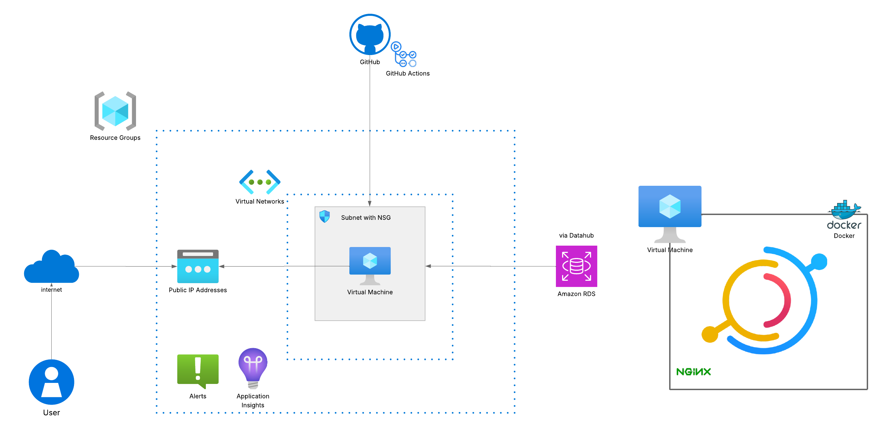

# DataHub Terraform Deployment

This Terraform project deploys a virtual machine in Azure with DataHub automatically installed using Docker.

## Project Structure

```
.
├── main.tf
├── variables.tf
├── outputs.tf
├── provider.tf
├── Dockerfile
├── docker-compose.yml
├── setup.sh
├── .gitignore
├── modules/
│   ├── network/
│   │   ├── main.tf
│   │   ├── variables.tf
│   │   └── outputs.tf
│   ├── security/
│   │   ├── main.tf
│   │   ├── variables.tf
│   │   └── outputs.tf
│   └── vm/
│       ├── main.tf
│       ├── variables.tf
│       └── outputs.tf
```

## Prerequisites

- Terraform installed (v1.0.0+)
- Azure CLI installed and authenticated
- SSH key pair for VM authentication
- Docker and Docker Compose (for local development)

## Deployment Options

### Option 1: Azure VM Deployment with Terraform

1. Initialize the Terraform project:

```bash
terraform init
```

2. Create a `terraform.tfvars` file with your SSH public key:

```
admin_ssh_key = "ssh-rsa AAAA..."
```

3. Review the deployment plan:

```bash
terraform plan
```

4. Apply the configuration:

```bash
terraform apply
```

5. After deployment, access DataHub at:

```
http://<vm_public_ip>:9002
```

### Option 2: Local Deployment with Docker Compose

1. Install Docker and Docker Compose on your local machine

2. Run the setup script:

```bash
chmod +x setup.sh
sudo ./setup.sh
```

Or manually execute the commands:

```bash
# Install Python dependencies
python3 -m pip install --upgrade pip wheel setuptools
python3 -m pip install --upgrade acryl-datahub

# Start DataHub using Docker
datahub docker quickstart
```

3. Access DataHub at:

```
http://localhost:9002
```

## Modules

### Network Module
Creates a virtual network and subnet for the deployment.

### Security Module
Sets up a network security group with rules for SSH, HTTP, HTTPS, and DataHub access.

### VM Module
Deploys a Linux VM and automatically installs DataHub using Docker.

## Customization

You can customize the deployment by modifying the variables in `variables.tf` or by providing a `terraform.tfvars` file with your own values.

For Docker-based deployments, you can modify the `docker-compose.yml` file to adjust service configurations.
